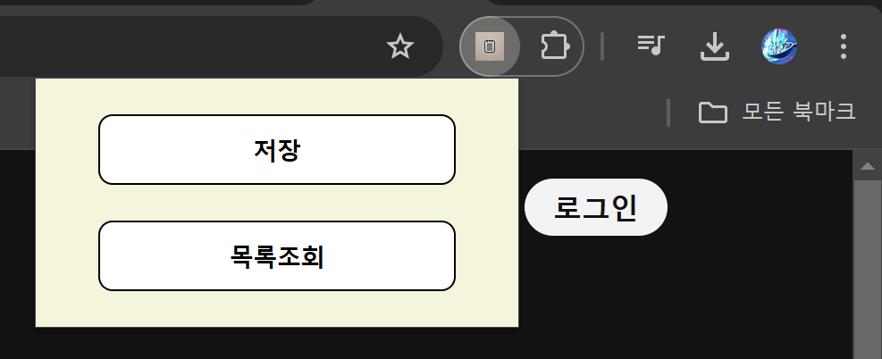
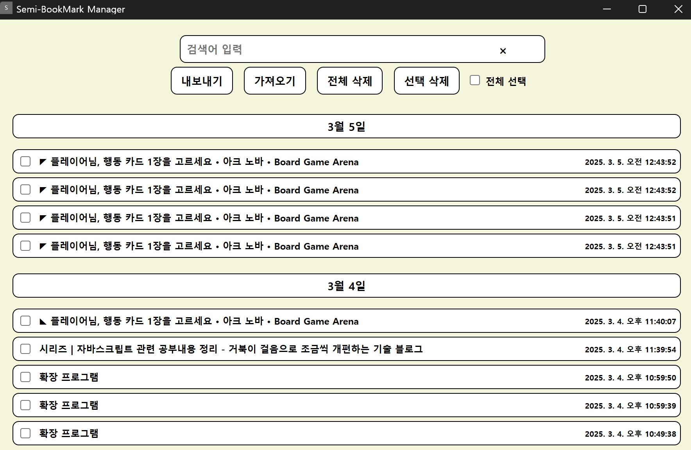
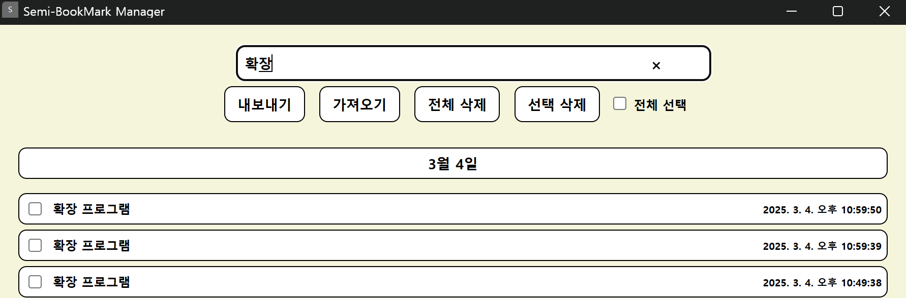

# Semi-BookMark - Chrome 확장 프로그램


> **간편한 세미북마크 저장 확장 프로그램!**  
> 북마크에 넣자니 자주 찾는 사이트가 아니고, 하지만 나중에 한 번 더 볼 것 같아서 그냥 창을 닫자니 찝찝했다면 이 프로그램으로 URL을 간단히 저장&삭제하세요!
>
> 한 번의 클릭으로 현재 페이지를 저장하고, 날짜별로 북마크를 쉽게 관리하세요.

---

## **기능 소개**

### 1. 원클릭 저장 – 현재 보고 있는 웹사이트를 저장

### 2. 날짜별 정렬 – 최신 날짜순으로 북마크 정리

### 3. 검색 기능 – 저장한 북마크를 빠르게 검색

### 4. 가져오기/내보내기 – 데이터 백업 및 복원

### 5. 선택 삭제 지원 – 개별 북마크 삭제 및 전체 삭제

---

## **스크린샷**

| 저장하기 버튼                   | 북마크 목록                       | 검색 기능                   |
| ------------------------------- | --------------------------------- | --------------------------- |
|  |  |  |

---

## **설치 방법**

### 1. **크롬 웹 스토어에서 다운로드:** [Chrome Web Store 링크](https://chrome.google.com/webstore/detail)

### 2. **수동 설치 (개발자 모드)**

- 이 저장소를 클론 또는 다운로드

```sh
git clone https://github.com/rkqls8522/Semi-BookMark.git
```

- 크롬 브라우저에서 chrome://extensions/로 이동
- "개발자 모드" 활성화 후 "압축해제된 확장 프로그램 로드" 클릭
- src 폴더 선택 후 확장 프로그램이 추가되었는지 확인

---

## 폴더 구조

```bash
📦 Semi-BookMark
┣ 📂 icons           			# 프로그램 로고 및 아이콘
┃ ┣ 📜 icon-16.png    		# 크롬 확장 아이콘 (16px)
┃ ┣ 📜 icon-48.png    		# 크롬 확장 아이콘 (48px)
┃ ┗ 📜 icon-128.png   		# 크롬 확장 아이콘 (128px)
┣ 📂 image       					# 스크린샷 이미지 저장 폴더
┃ ┣ 📜 저장화면.png      # 저장 버튼 UI 캡처
┃ ┣ 📜 날짜별목록화면.png  # 북마크 목록 화면
┃ ┗ 📜 검색화면.png      # 검색 기능 UI 캡처
┣ 📂 src              		# 크롬 확장 프로그램 소스 코드 폴더
┃ ┣ 📜 popup.js     			# 팝업에서 실행되는 스크립트
┃ ┣ 📜 program.js   			# 북마크 관리 화면 기능
┃ ┣ 📜 background.js   		# popup or program을 열어주는 기능능
┃ ┣ 📜 popup.html   			# 팝업 UI
┃ ┗ 📜 program.html 			# 북마크 목록 화면
┣ 📜 manifest.json  		# 크롬 확장 프로그램 설정 파일
┣ 📜 README.md        		# 깃허브 설명 문서
```

### 📂폴더 구조 설명

📂 icons/ → 확장 프로그램 로고 및 아이콘 저장

📂 image/ → 프로그램 주요 화면 캡처 저장

📂 src/ → 기능별 파일 저장

📜 manifest.json → 크롬 확장 프로그램의 설정 파일

📜 README.md → 깃허브 메인 설명 파일

## 🤝 **기여 방법**

1. 이 저장소를 포크(Fork)
2. dev-be나 dev-fe로 이동 (`git checkout dev-be`)
3. 새로운 브랜치를 생성 및 이동동 (`git checkout -b feature-branch`)
4. 기능 추가 후 커밋 (`git commit -m "설명 추가"`)
5. 원격 저장소에 푸시 (`git push origin feature-branch`)
6. Pull Request 요청

---

---

## 📩 **문의 & 지원**

📧 이메일: [qnrpxn@gmail.com](mailto:qnrpxn@gmail.com)
